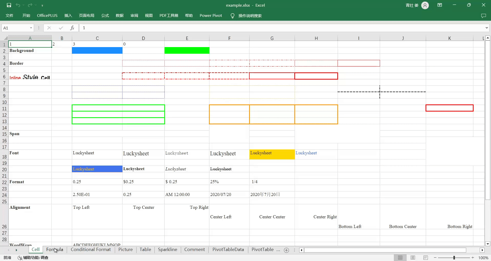

# 介绍
本项目是基于poi的luckysheet导出工具，可以与luckysheet无缝集成，目前支持导出luckysheet的单元格样式、sheet表、条件格式，后续会继续完善。

# 特性
目前已经支持的一下样式的导出
- 单元格样式
    - [x] 填充单元格数据
    - [x] 填充字体
    - [x] 填充字体颜色
    - [x] 填充加粗
    - [x] 填充斜体
    - [x] 填充字体大小
    - [x] 填充删除线
    - [x] 填充下划线
    - [x] 填充垂直对齐
    - [x] 填充水平对齐
    - [x] 填充文本旋转
    - [x] 填充文本溢出换行
    - [x] 填充引用前缀
    - [x] 填充背景色
    - [x] 填充文本格式
    - [x] 公式

- sheet表样式
    - [x] 填充sheet表名称
    - [x] 单元格合并
    - [x] 设置边框
    - [x] 设置行宽，列高
    - [x] 设置隐藏行，隐藏列
    - [x] 冻结表头
- 条件格式
  - [x] 色阶
  - [x] 数据条(有问题，样式与luckysheet的不一致)
  - 图标集
    - [x] threeWayArrowMultiColor：三向箭头（彩色）
    - [x] fourWayArrowMultiColor：四向箭头（彩色），
    - [x] fiveWayArrowMultiColor：五向箭头（彩色），
    - [x] threeWayArrowGrayColor：三向箭头（灰色），
    - [x] fourWayArrowGrayColor：四向箭头（灰色），
    - [x] fiveWayArrowGrayColor：五向箭头（灰色），
    - [x] threeColorTrafficLightRimless：三色交通灯（无边框），
    - [x] threeSigns：三标志，
    - [x] greenRedBlackGradient：绿-红-黑渐变，
    - [x] threeColorTrafficLightBordered：三色交通灯（有边框），
    - [x] fourColorTrafficLight：四色交通灯，
    - [x] threeSymbolsCircled：三个符号（有圆圈），
    - [x] tricolorFlag：三色旗，
    - [x] threeSymbolsnoCircle：三个符号（无圆圈），
    - [x] fiveQuadrantDiagram：五象限图，
    - [x] grade4：四等级，
    - [x] grade5：五等级，
    - [ ] threeTriangles：3个三角形，(目前用“三向箭头（彩色）”代替)
    - [ ] threeStars：3个星形，
    - [ ] fiveBoxes：5个框，(目前用“五象限图”代替)

  - 突出显示单元格规则
    - [x] "greaterThan": 大于
    - [x] "lessThan": 小于
    - [x] "betweenness": 介于
    - [x] "equal": 等于
    - [x] "textContains": 文本包含
    - [x] "duplicateValue": 重复值
    - [x] "top10": 前 N 项
    - [x] "top10%": 前 N%
    - [x] "last10": 后 N 项
    - [x] "last10%": 后 N%
    - [x] "top10": 前 N 项
    - [x] "top10%": 前 N%
    - [x] "last10": 后 N 项
    - [ ] "occurrenceDate": 发生日期 
    - [x] "AboveAverage": 高于平均值 (有问题，后期需要修复)
    - [x] "SubAverage": 低于平均值 (有问题，后期需要修复)
- [x] 图片
- [ ] 数据验证
- [ ] 数据透视表
- [ ] 批注
- [ ] 图表
- [ ] 筛选

# 效果预览
官方案例导出效果预览


# 使用方式
第一步 引入依赖
```xml
<dependencies>
  
  <dependency>
    <groupId>io.github.goodbey857</groupId>
    <artifactId>luckysheet-xlsx</artifactId>
    <version>1.0.0</version>
  </dependency>

  <dependency>
    <groupId>org.springframework.boot</groupId>
    <artifactId>spring-boot-starter-web</artifactId>
    <version>2.7.6</version>
  </dependency>
  
</dependencies>
```

第二步 编写controller
```java

@CrossOrigin(origins = "*")
@Controller
public class DemoController {

  @PostMapping("/luckyToXlsx")
  public void export(@RequestBody String json, HttpServletResponse response){

    // JSONReader 提取json的data属性
    JSONObject jsonObject = JSONObject.parseObject(json);
    String fileName = jsonObject.getString("title");
    response.setContentType("application/vnd.openxmlformats-officedocument.spreadsheetml.sheet");
    response.setHeader("Content-Disposition", "attachment;filename=" + fileName + ".xlsx");
    response.setCharacterEncoding("utf-8");
    // 获取data属性
    String data = jsonObject.getString("data");
    String order = jsonObject.getJSONObject("exportXlsx").getString("order");

    try {
      LuckysheetXlsx.export(data,order, response.getOutputStream());
    } catch (IOException e) {
      throw new RuntimeException(e);
    }
  }
}

```
第三步 创建luckysheet实例
```js
var option = {
  ...,  // 其他配置,
  plugins: [{ 
    name: 'exportXlsx', 
    config: { 
      url: "http://localhost:8080/luckyToXlsx" //url配置为自己本地的导出地址
    }
  }]
};

luckysheet.create(options);
```
现在就可以点击工具栏的导出按钮，实现导出功能。
